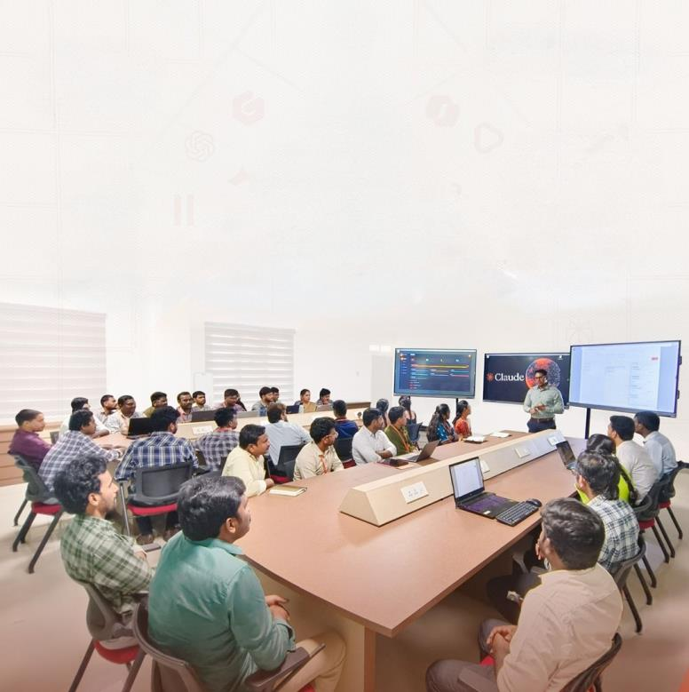

# Technical Hub × Aditya University — Claude AI Success Story

A static, single-page website presenting the success story *"How Technical Hub Transformed
Productivity at Aditya University with Claude AI."* The design is modelled on
[adityauniversity.in](https://www.adityauniversity.in/) (navy-blue + orange palette,
Poppins/Open Sans typography, Bootstrap responsive layout).

## Tech stack
Same family as the reference site — a static, responsive HTML/CSS/JS build:

- **HTML5** — semantic single-page layout
- **Bootstrap 5.3** (CDN) — responsive grid, navbar, utilities
- **Bootstrap Icons** (CDN)
- **Google Fonts** — Poppins (headings) + Open Sans (body)
- **Vanilla JavaScript** — scroll-reveal, animated stat counters, sticky-nav, back-to-top

No build step or server required — it's fully static.

## Structure
```
technical-hub-claude-site/
├── index.html        # all content sections
├── css/style.css     # custom theme (Aditya palette)
├── js/main.js         # interactivity
└── assets/            # drop event photos here (see below)
```

## Sections
Hero · Stats · Executive Summary · Faculty Development Programs · Project Space Hackathon
· Claude Incentives · Project Specification Application (platform) · Results & Outlook · Contact · Footer

## Run it
Just open `index.html` in any browser, or serve the folder:
```powershell
python -m http.server 8000   # then visit http://localhost:8000
```

## Adding the real photos
The case-study images currently render as styled placeholders. To use the real event
photos from the PDF, save them into `assets/` and replace a placeholder block, e.g.:

```html
<!-- replace this -->
<div class="image-placeholder"><i class="bi bi-easel2-fill"></i><span>Faculty Development Workshop</span></div>
<!-- with -->

```
